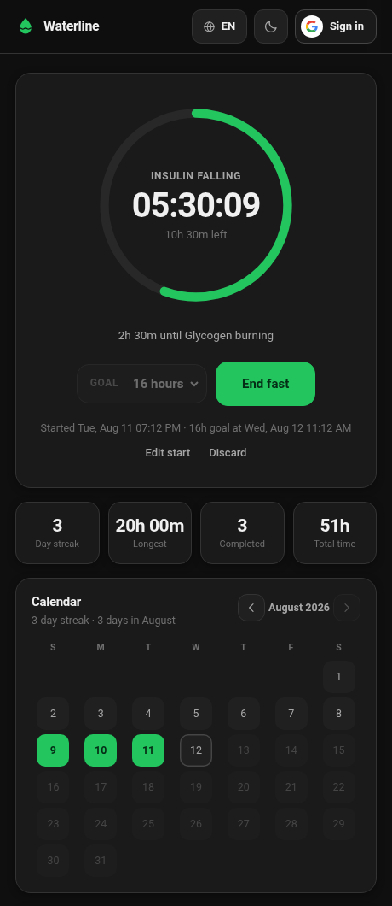
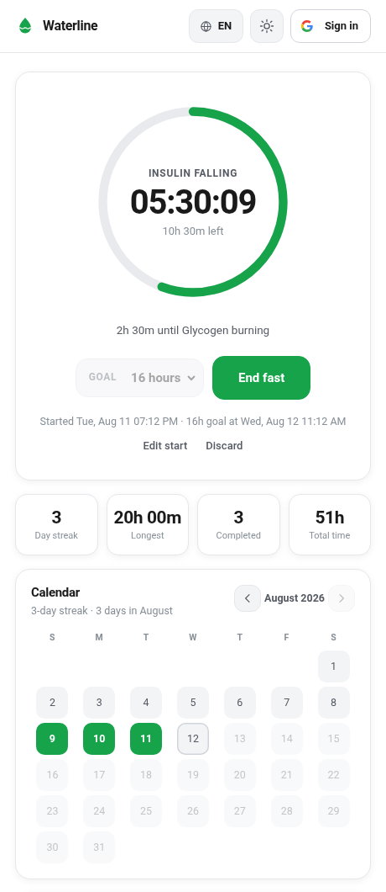

<div align="center">


# Waterline

**Fill your waterline.**
A free, real-time water fasting tracker — no build step, no backend to run, no cost.

 

</div>

---

## What it is

A fasting timer you can read in one glance. Pick a goal, hit begin, and one ring fills
while the clock counts. Along the way it tells you what's happening inside you — insulin
falling, glycogen emptying, ketosis, autophagy — and cheers you on when you cross each
threshold.

The face shows time elapsed and time left. Pass the goal and it keeps counting: the ring
turns amber, and the fast is logged at its true length. Ending asks *when* you broke it
(defaulting to now, never accepting a future time), and any logged fast's start and end can
be corrected afterwards. A **streak calendar** chains your consecutive days together.

- **Hide the clock.** One switch in Settings and a running fast shows nothing but the ring. See below.
- **Real-time sync.** Start a fast on your laptop, watch it tick on your phone. No refresh, no button.
- **Works signed out.** Everything runs from `localStorage`. Sign in later and your history moves with you.
- **Works offline.** Installable PWA. Offline changes queue and flush when you reconnect.
- **Zero build.** Plain ES modules. The folder *is* the website.
- **Dark and light.** Follows your system, remembers your choice.
- **English and Korean.** One tap in the header swaps the interface; your own data — times,
  durations, dates — always stays in your device's own locale.

## Hide the clock

Watching a countdown is the surest way to make a fast feel long. **Settings (⚙) → Hide the
clock** turns the timer card into a game: while a fast is running you get the ring, the
metabolic stage you are in, and a percentage — and nothing that can be turned back into a
time.

| | Clock shown | Clock hidden |
|---|---|---|
| Ring face | `05:36:06` | `35%` |
| Under it | `10h 24m left` | — (`Goal reached` once you pass it) |
| Coach line | `2h 24m until Glycogen burning` | `Next up: Glycogen burning` |
| Goal picker | `Goal · 16 hours`, greyed | put away |
| Below the button | `Started Wed, Aug 12 03:32 PM · 16h goal at Thu, Aug 13 07:32 AM` | put away |
| Milestone toast | *"Twelve hours. You're officially burning fat for fuel."* | *"Glycogen runs low and lipolysis takes over…"* |

Four rules keep it honest:

- **Only while a fast is running.** Idle, you still see and pick your goal — there is nothing
  to hide yet, and a settings screen that appears to do nothing is a broken settings screen.
- **Nothing about the fast changes.** It is recorded at its true length, the ring still turns
  amber at the goal, and the end-of-fast sheet reveals the full duration. Hiding is a *view*.
- **The percentage is the real one**, floored, and capped at 99% until the goal is genuinely
  met — rounding would print `100%` a couple of minutes early and then keep counting.
- **There is always a way out.** **Peek** under the button uncovers everything for eight
  seconds, or puts it straight back; the stage timeline is left alone, because the story of
  what your body is doing is the half worth keeping.

The setting lives on your user document beside your goal, so it follows you to every device
you are signed in on. Signed out it is saved to this browser, like everything else.

## The design

Flat surfaces, one accent colour, no gradients, no blur, no glow — the palette is shared
with [hanifedma.com/ponder](https://hanifedma.com/ponder/) so the two apps read as one
family. Everything sits in a single 640 px column, and every control in the header speaks
the same shape language: 40 px tall, 1 px border, 11 px radius.

Type is San Francisco — Apple's system typeface — reached through `-apple-system`. On
Windows it falls back to Segoe UI, on Android to Roboto. Nothing is downloaded, so there is
no font request on any connection.

The colour in the interface comes from emoji rather than from illustration: 🔥 🏆 ✅ ⏳ on the
stats, 📅 📋 🔬 on the headings, 🏆 or 💧 on every logged fast, and one emoji per metabolic
stage. They're the system colour font, so they cost nothing to download and they carry
meaning instead of decorating. The app icon, favicon and social card are all flat accent
green on ink — regenerate them from `icons/icon-source.svg` and `favicon.svg`.

Switching theme cross-fades every colour over 1.5 s rather than snapping, which is why
`.theming` exists: it applies the long transition only during a deliberate toggle, so
ordinary hover stays instant.

### The ring is eased on purpose

Real progress is linear and, early on, invisible: twenty minutes into a 16-hour fast is 2% —
a sliver that reads as *you have done nothing*. So the ring is drawn through `p^0.55`, which
front-loads the fill and then slows as you approach the goal:

| Elapsed | True progress | Ring shows |
|---|---|---|
| 20 min of 16 h | 2% | 12% |
| 1 h 36 m of 16 h | 10% | 28% |
| 5 h 30 m of 16 h | 34% | 56% |
| 8 h of 16 h | 50% | 68% |
| 14 h 24 m of 16 h | 90% | 94% |
| 16 h of 16 h | 100% | 100% |

It still starts empty and lands exactly on full at the goal, so it never disagrees with
itself. **Nothing numeric is eased** — the clock, the time remaining, the logged duration,
the streak and every statistic are the real values. `RING_CURVE` in `js/app.js` is the one
knob; set it to `1` for a linear ring.

## Built to run anywhere

The first screen is 140 KB of HTML, CSS and JavaScript — **42 KB over the wire** once your
server gzips it — and it downloads **no fonts, no frameworks and no images** to render.
(A third of the source is Korean translations and comments, both of which compress away.)

- The whole module graph is declared with `modulepreload`, so `app.js`, `store.js`,
  `stages.js`, `i18n.js` and `config.js` are fetched in parallel instead of in a
  four-deep waterfall.
- The Firebase SDK is a dynamic `import()` that only runs once you've configured it, and
  never blocks the first paint.
- A service worker caches the shell, so every visit after the first renders offline-instantly.
- The ring is only written to the DOM when it *visibly* moves. Naively, a 16-hour fast nudges
  `stroke-dashoffset` by a fraction of a pixel every second, and each write restarts a 700 ms
  transition — a permanent repaint loop for a change no one can see.
- A hidden tab pauses the one-second clock entirely. Sitting idle, Waterline performs zero
  DOM writes per second; running, exactly one.
- There is nothing expensive enough to need a "low power" mode. `prefers-reduced-motion` is
  honoured in CSS and that's the whole story.
- Firestore write acknowledgements are never awaited. Offline they never arrive, and awaiting
  one would hang the UI on a write the local cache has already applied.

## Run it locally

Any static server. From this folder:

```bash
python3 -m http.server 8000
# open http://localhost:8000
```

Opening `index.html` directly with `file://` will **not** work — ES modules and service
workers both require `http://`. That's the only requirement.

With no Firebase configured, Waterline runs in **local mode**: fully functional, saved to
this browser, nothing leaves the machine. That is a legitimate way to use it forever.

## Turn on Google sign-in + cross-device sync

Free forever on Firebase's Spark plan for personal use.

1. Create a project at [console.firebase.google.com](https://console.firebase.google.com).
2. **Build → Authentication → Get started → Sign-in method →** enable **Google**.
3. **Build → Firestore Database → Create database →** start in **production mode**, pick a region.
4. **Firestore → Rules →** replace everything with the contents of [`firestore.rules`](firestore.rules), then **Publish**.
   This is what stops anyone else reading your fasts. Don't skip it.
5. **Project settings (⚙) → General → Your apps →** click the web icon `</>`, register the app,
   and copy the `firebaseConfig` values.
6. Paste them into [`js/config.js`](js/config.js).
7. **Authentication → Settings → Authorized domains →** add `localhost` and the domain you
   deploy to, e.g. `yourname.github.io`.
8. **Google Cloud console → APIs & Services → Credentials →** open *Web client (auto created
   by Google Service)*. Copy its **client id** into `googleClientId` in
   [`js/config.js`](js/config.js), and add your origins under **Authorized JavaScript
   origins** — see [below](#why-the-dialog-names-this-site) for why this step is the one
   that decides what Google's dialog calls you.

Reload. The footer flips from `Local mode` to `Synced as …`, and any fasts you recorded as a
guest are moved into your account automatically.

> The values in `js/config.js` are **not secrets** — they identify your project, they don't grant
> access to it. Access is decided entirely by `firestore.rules`. They are safe to commit publicly.

### Why the dialog names this site

Ask Firebase to sign someone in the usual way — `signInWithPopup` — and Google's
account chooser reads **"Choose an account to continue to
waterline-af54d.firebaseapp.com"**: a raw project id, shown at the one moment someone is
deciding whether to trust you with their Google account.

That address is not decoration. Firebase's popup hands off to `authDomain`, so
`firebaseapp.com` is the origin that receives the redirect, and Google names the origin it
redirects to. It won't name your app instead, because an unverified app's name is just text
someone typed into a console — display it unchecked and the consent screen becomes the best
phishing surface on the internet.

So Waterline doesn't redirect. **Google's own button is rendered on the page**, hands back an
ID token, and [`store.js`](js/store.js) trades it for a Firebase session with
`signInWithCredential`. The browser never leaves the site, so the site is what Google names.
It is the same exchange the Android app makes with the token Credential Manager gives it —
one shape on both platforms, a redirect on neither.

**What you have to do once:** authorise the origins. **Google Cloud console → APIs &
Services → Credentials →** open *Web client (auto created by Google Service)* →
**Authorized JavaScript origins** → add the origin you serve from, with no path:

```
https://hanifedma.com
http://localhost:8000        ← only if you develop locally
```

Skip it and the button still draws, but clicking it fails inside Google's popup — where
nothing can report a reason back to the page. That is why the dialog always offers a second
route as well, and why that route is promoted to the only visible button whenever the first
one can't be drawn: blocked script, no client id, an origin Google won't take. It runs the
old redirect flow, which works everywhere and names `firebaseapp.com`, which is a poor
greeting but a fine parachute.

The client id lives in [`js/config.js`](js/config.js) beside the Firebase keys and is public
in exactly the same way — it is *meant* to be read out of the page. All of its security is
that it refuses to work from an origin you haven't listed above.

Two things this does not fix:

- **The button's own language is Google's to choose.** Waterline passes its current
  language, and Google may still draw the button in the one it infers from the reader's
  location. Everything around the button follows the header toggle.
- **Android still shows the project id**, because there is no redirect there to move. The
  phone's sheet renders the project's OAuth *brand*, so the only lever is the brand's
  **App name** (Google Cloud console → Google Auth Platform → Branding, mirrored at Firebase
  → Project settings → General → Public-facing name). Google
  [displays that name only once the brand is verified](https://support.google.com/cloud/answer/15549049) —
  set it, look, and submit for verification if a domain is still showing. Waterline's scopes
  (`email`, `profile`, `openid`) are all non-sensitive, so that review is about branding
  rather than a security assessment.


## Deploy to GitHub Pages

```bash
git push -u origin main
```

Then **Settings → Pages → Source: Deploy from a branch → `main` / `root`**. Live in a minute at
`https://YOURNAME.github.io/YOURREPO/`.

Two things to update once you know your URL — search engines and social previews use them:

- `index.html` — the `canonical`, `og:url`, and `og:image` / `twitter:image` tags
- `sitemap.xml` and `robots.txt` — the `<loc>` and `Sitemap:` lines

Every internal path is relative, so the app works from a subfolder without any other change.

**After every deploy, bump `VERSION` in [`sw.js`](sw.js).** The service worker serves the old
cached CSS and JS until that string changes, so a stale version is the usual reason a deploy
"didn't take".

## How the sync works

| | Signed out | Signed in |
|---|---|---|
| Storage | `localStorage` | Firestore, under `users/{your-uid}` |
| Reads | direct | `onSnapshot` listeners — push, not poll |
| Offline | always | Firestore persistent cache, writes replay on reconnect |

Both reads are validated on the way in, exactly as `localStorage` is: `firestore.rules`
rejects a malformed fast, but it does not police the Firebase console, and one record with no
`end` would turn every statistic into `NaN`. Nothing is painted until the *user* document has
answered, either — it is the one carrying the running fast, and repainting before it lands
flashes the Begin button at someone who is eleven hours in.

A running fast is one field on your user document, your settings are another, and each
finished fast is its own document. Because every read is a live listener, changing anything on
one device repaints the others immediately — flip **Hide the clock** on your laptop and your
phone's ring covers itself while you watch. Signing in for the first time merges your guest
history in, de-duplicating by start time, then clears the guest store.

```
users/{uid}
  activeFast : { start, goalHours } | null
  settings   : { goalHours, hideTimes }
  fasts/{id} : { start, end, goalHours }
```

`settings` is a map on a document `firestore.rules` already lets its owner write, so adding a
field to it needs no rules change and no deploy.

## Layout

```
index.html            app shell, SEO tags, JSON-LD
404.html              themed, bilingual not-found page
css/style.css         design tokens, dark + light themes
docs/                 README screenshots
js/config.js          ← your Firebase keys go here
js/store.js           local + Firestore backends behind one interface
js/stages.js          metabolic timeline, encouragement copy (English, canonical)
js/i18n.js            interface translations (English + Korean) and the language switch
js/app.js             rendering, timer loop, streak calendar, milestone celebrations,
                      the settings sheet and the hide-the-clock view
sw.js                 offline shell cache — bump VERSION on every deploy
firestore.rules       owner-only access — publish this
test.html             open it in a browser; 111 assertions, no dependencies
```

## Health note

Waterline is an informational tool, **not medical advice**. Extended water fasting can be
dangerous if you are pregnant or breastfeeding, underweight, diabetic, taking medication, or
have a history of disordered eating. Talk to a doctor before fasting beyond 24 hours, mind your
electrolytes on long fasts, break long fasts gently — and stop immediately if you feel faint,
confused, or unwell.

## Licence

MIT. Use it, change it, ship it.
